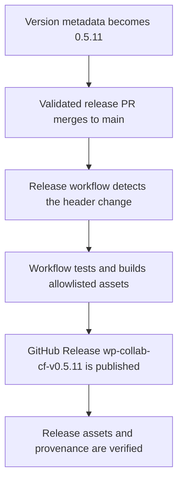

# WP Collab Cloudflare 0.5.11 Release - Plan

## Goal Capsule

- **Objective:** Publish an installable plugin release that includes the Yoast featured-image refresh fix merged in `22012b1`.
- **Means:** Advance the plugin metadata to `0.5.11` and let the existing main-branch release workflow build and publish the verified assets (KTD1).
- **Authority:** The Product Contract defines the release contents and identity. The Planning Contract defines how the existing release automation is triggered.
- **Execution profile:** One metadata-only implementation unit followed by repository tests, PR validation, merge, and release verification.
- **Stop conditions:** Stop if version surfaces disagree, the release tag already exists with different provenance, or the publication workflow does not produce verifiable assets.
- **Tail ownership:** The shipping caller owns PR merge and confirmation of the public GitHub Release after implementation completes.

## Product Contract

### Summary

Publish `wp-collab-cf` version `0.5.11` from current `main` so the downloadable plugin includes the Yoast REST featured-image correction that is absent from the existing `0.5.10` assets.

### Problem Frame

The fix landed after `0.5.10` had already been published. The [release workflow run for merge commit `22012b1`](https://github.com/phillypublishing/wp-collab-cloudflare/actions/runs/33170909379) reported that version `0.5.10` was unchanged and skipped every build and publish step, leaving no released ZIP that contains the fix.

### Requirements

- R1. The `Version:` header and runtime constant in `plugin/wp-collab-cf/wp-collab-cf.php`, the package version, and the `version` plus `packages[""]` fields in the plugin package lock must all declare `0.5.11`.
- R2. The release commit must preserve the Yoast featured-image fix from merge commit `22012b1` without adding unrelated runtime behavior.
- R3. Merging the version bump to `main` must trigger the existing WordPress plugin release workflow for tag `wp-collab-cf-v0.5.11`.
- R4. The published release must be non-draft and include the installable ZIP, its SHA-256 checksum, and the provenance manifest generated from the release source commit.
- R5. The complete source delta after the published `0.5.10` release commit must contain only the Yoast fix, the `0.5.11` release metadata, and release-planning documentation.

### Key Decisions

- **Publish as `0.5.11`.** (session-settled: user-approved — chosen over leaving the already-published `0.5.10` unchanged: the existing `0.5.10` assets predate the featured-image fix.) Governs R1, R3, R4.

### Scope Boundaries

- Do not modify plugin runtime behavior, release workflow logic, or artifact composition unless existing verification exposes a release-blocking defect.
- Do not replace, retag, or mutate the published `0.5.10` release.
- Do not include unrelated version or dependency upgrades.

## Planning Contract

### Key Technical Decisions

- KTD1. **Use the established version-header release signal.** The workflow reads the `Version:` header in `plugin/wp-collab-cf/wp-collab-cf.php` and derives the release tag from that version. Update every synchronized version surface while leaving release automation unchanged. The existing `wp-plugin-release.yml` workflow owns testing, artifact construction, checksum generation, manifest verification, and publication for R1-R4.
- KTD2. **Verify provenance after publication.** Treat workflow success alone as insufficient. Confirm that the release manifest and asset names identify `0.5.11` and the new main-branch release commit, which must contain `22012b1`.

### Assumptions

- The existing release workflow remains enabled with permission to create tags, releases, and assets.
- No unrelated commit advances `main` between the release PR merge and publication. If it does, the published source may include that commit but must still contain `22012b1` and satisfy R1-R4.

### Operational Notes

- A failed upload may be retried only through the existing resumable draft transaction. Conflicting tags, releases, assets, or provenance stop publication for investigation; do not delete or retag a public release to force success.

### High-Level Technical Design

## Implementation Units

### U1. Advance synchronized plugin release metadata

- **Goal:** Create the minimal source change that triggers the `0.5.11` release.
- **Requirements:** R1, R2, R3.
- **Dependencies:** None.
- **Files:**
  - `plugin/wp-collab-cf/wp-collab-cf.php`
  - `plugin/wp-collab-cf/package.json`
  - `plugin/wp-collab-cf/package-lock.json`
- **Approach:** Update the header, runtime constant, and package metadata together. Preserve dependency versions and all plugin behavior. Use the existing release detector and artifact verifier as the behavioral contract per KTD1.
- **Execution note:** This is release metadata work. Existing release tests are version-agnostic, so no test-source change is expected.
- **Patterns to follow:** Mirror the synchronized version change used by prior plugin releases and the agreement checks in `scripts/plugin-artifact.mjs` and `tests/plugin-release.test.mjs`.
- **Test scenarios:**
  - Read the plugin source at `0.5.11` and confirm the header, runtime constant, and package version agree.
  - Confirm the top-level `version` and `packages[""]` version in `plugin/wp-collab-cf/package-lock.json` declare `0.5.11` without changing dependency versions.
  - Compare a `0.5.10` parent with the `0.5.11` source and confirm the release detector selects tag `wp-collab-cf-v0.5.11`.
  - Build the installable artifact and confirm its ZIP name and manifest report `0.5.11` without adding non-allowlisted files.
- **Verification:** The version agreement checks, release contract tests, plugin suite, build, PHP lint, and reproducible artifact test pass. The source diff contains only the intended version metadata and this plan artifact.

## Verification Contract

| Gate | Command or evidence | Done signal |
|---|---|---|
| Release contracts | `node --test tests/plugin-release.test.mjs tests/workflow-contract.test.mjs` | Release detection and workflow contracts pass for synchronized versions. |
| Plugin tests | `npm --prefix plugin/wp-collab-cf test` | The complete plugin test suite passes. |
| Plugin build | `npm --prefix plugin/wp-collab-cf run build` | Production assets compile without errors. |
| PHP checks | The PHP lint and diagnostic commands defined by `.github/workflows/wp-plugin-release.yml` | All plugin and compatibility PHP checks pass. |
| Reproducible package | `./tests/plugin-artifact.test.sh` | ZIP, checksum, allowlist, and manifest verification pass. |
| Release scope | Git history and diff from the `0.5.10` release source commit through the proposed release source | Every intervening commit and changed runtime file is accounted for by R2 and R5. |
| Tag availability | `git ls-remote --tags origin 'wp-collab-cf-v0.5.11'` and the GitHub Releases list | No tag or release named `wp-collab-cf-v0.5.11` exists before merge. |
| PR gate | GitHub reports all required checks complete and successful on the release PR head. | The PR is clean and mergeable with no unresolved review feedback. |
| Publication | GitHub Release `wp-collab-cf-v0.5.11`, its workflow run, and the attached provenance manifest | The release is public; the manifest names version `0.5.11`; its source commit contains `22012b1`; and the ZIP digest matches the published checksum. |

## Definition of Done

- U1 is complete and every version surface declares `0.5.11`.
- Local and GitHub verification gates pass without weakening existing tests or release checks.
- The release PR is merged to `main`.
- GitHub Release `wp-collab-cf-v0.5.11` is public with the expected verified assets.
- The release source commit contains the Yoast featured-image fix from `22012b1`.
- No abandoned experiments, generated archives, or unrelated source changes remain in the branch diff.
